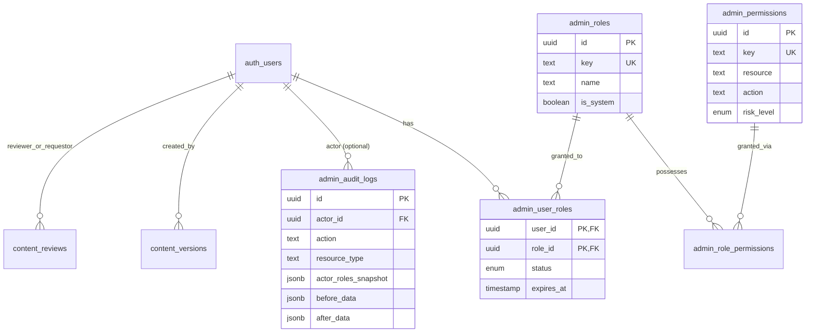

# Schema Administrativo (Etapa 2)

Abaixo está o modelo atualizado de entidades para o RBAC e auditoria.

## Diagrama de Relacionamento (ERD)

## Resumo das Novas Entidades

1. **RBAC (`admin_roles`, `admin_permissions`, `admin_role_permissions`, `admin_user_roles`)**: Centraliza o controle de acesso por usuários da base Supabase. As RLS validam contra `has_permission()`.
2. **Convites (`admin_invitations`)**: Evita criação prévia de contas antes do funcionário aceitar o papel.
3. **Auditoria Refinada (`admin_audit_logs`)**: Herdada da `audit_logs` inicial, agora como tabela *Append-Only* com trigger estrito bloqueando deletes ou updates até mesmo para super admins na aplicação. Armazena o "antes/depois" (diff) e os papeis no momento da ação (snapshot) para histórico perfeito.
4. **Governança de Conteúdo (`content_versions`, `content_reviews`, `publication_schedules`)**: Viabiliza aprovação de conteúdo clínico antes de ir a público e agendamento de posts (Stories).
5. **Ajustes Adicionais**: Tabelas `webhook_events` melhoradas (retries/hashes), e `feature_flags`/`app_settings` com governança RLS e suporte a AAL2.
